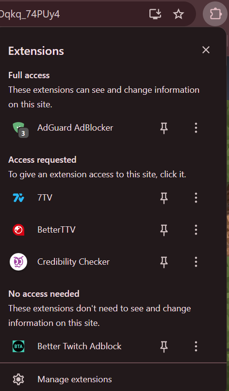

# Development Diary - 09/10/2025
## Task / Work Summary
Today's work represents major foundational progress: extension skeleton ready, frames captured, backend scaffolded with local FastAPI endpoint, and deterministic AI logic placeholder implemented. The project now has a clear workflow from user interaction to backend analysis, and remaining work is focused on connecting these components and refining the AI analysis. Future work could explore cloud deployment (AWS Lambda, Google Cloud) for scalability.

## Context/Problem/Challenge 
Problem / Challenge:
The overarching challenge is the rise of deepfake videos on social media platforms such as YouTube, X (Twitter), and Reddit. Users have limited tools to verify the authenticity of videos without interacting directly with these platforms. The aim of the project is to create a tool that can capture and analyze video content from these sites, providing deterministic feedback on potential deepfakes.

Approach / Method:
A solution was chosen, a browser extension for capturing video frames. This approach allows minimal interference with the social media platform itself while giving users actionable insights.

Response / Solution:
Today, we progressed substantially on both the front-end and backend. The browser extension can now capture frames from YouTube, X, and Reddit videos, and the system is structured to communicate with a backend for analysis. The foundations for deterministic AI-based analysis and overlay display were established.

## Design and Implementation
### Challenge 1: Defining the project scope and platform choice

Context / Problem:
Originally, there was consideration of building a mobile “shell app” that overlays social media apps. This was technically ambitious and time-consuming, particularly for iOS, and would require Swift/Xcode rather than Python.

Approach / Method:
We evaluated feasibility, considering development time, existing skills, and project goals. Options included:
- Mobile container app (high complexity)
- Standalone PC app with web browser extension (moderate complexity, Python-compatible)
- Browser extension alone

Response / Solution:
Decision: Focus on a browser extension + backend system. This targets YouTube, X, and Reddit, allows modular future expansion, and can use Python for backend AI processing.

---
### Challenge 2: Building the skeleton extension

Context / Problem:
The extension needed to inject a “Check Authenticity” button on video pages dynamically, capture short snippets/frames, and communicate with the backend.

Approach / Method:
- Manifest file (v3) configured for target sites
- Content script (content.js) to detect video elements and inject the button
- Background script (background.js) to handle messages and communicate with backend
- Lightweight deterministic AI model placeholder for frame analysis using OpenCV

Response / Solution:
- Extension now injects the button correctly on YouTube video pages.
- Frames are captured (5 per video snippet) and logged successfully in console ([CredibilityChecker] Captured 5 frames).
- Local FastAPI backend server was scaffolded for frame analysis.

---
### Challenge 3: Backend integration

Context / Problem:
Ensuring the backend could receive frames, perform deterministic analysis, and respond to the extension was crucial. Initial tests using empty frames failed due to missing or invalid input.

Approach / Method:
- Local FastAPI server (fastapi_server.py) prepared
- Console logging added for debugging and visibility of frame processing

Response / Solution:
- Backend endpoint ready for integration with Chrome extension
- Server reachable via http://127.0.0.1:8000/analyze for local testing
- Cloud deployment (AWS Lambda, Google Cloud) could be explored as a future scalability option

---
### Challenge 4: Testing and troubleshooting

Context / Problem:
Extension button visible but initially didn’t trigger analysis
Errors due to backend URL misconfiguration, empty frame payloads, and PowerShell curl syntax issues

Approach / Method:
- Verified content script frame capture with console logs
- Diagnosed fetch errors and URL endpoints
- Adjusted testing commands for PowerShell syntax (Invoke-RestMethod)

Response / Solution:
- Confirmed frame capture works
- Identified backend communication as the main remaining hurdle
- Prepared debugging instructions and placeholder logic to allow immediate feedback from the backend in future sessions

---
## Evaluation / Reflection

Insights gained:
- Frame capture and dynamic button injection are functional and reliable.
- Deterministic placeholder AI allows simulation of analysis results without requiring full model training.
- Backend integration, both local and AWS Lambda, is structured correctly but requires actual frame decoding logic for full operation.
- PowerShell / Windows testing requires careful attention to syntax differences (curl vs Invoke-RestMethod).

Lessons learned:
- Planning for platform constraints early prevents wasted effort (deciding against iOS shell app).
- Incremental testing (frame capture → backend response → overlay) is effective for complex web integrations.
- Logging at every step is essential to understand asynchronous browser extension behavior.

## Screenshots / Images

  

  

## References / Resources
https://fastapi.tiangolo.com/tutorial/
https://developer.chrome.com/docs/extensions/get-started/tutorial/hello-world

## Next Steps / To-Do
1) Implement frame decoding in the backend, handling empty or invalid frames gracefully.
2) Connect Chrome extension to backend and verify overlay displays results.
3) Refine deterministic AI placeholder with simple metrics (e.g., sharpness, blur).
4) (Future) Explore cloud deployment (AWS Lambda, Google Cloud) for scalability and redundancy.

