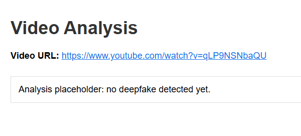
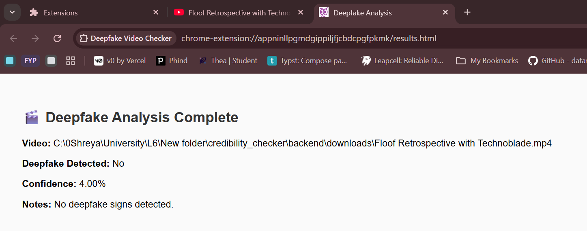
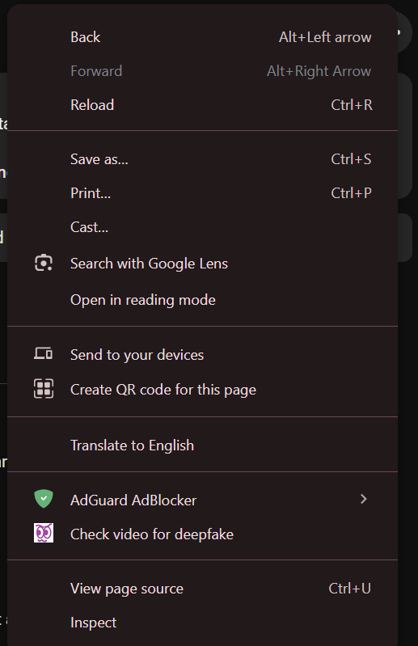
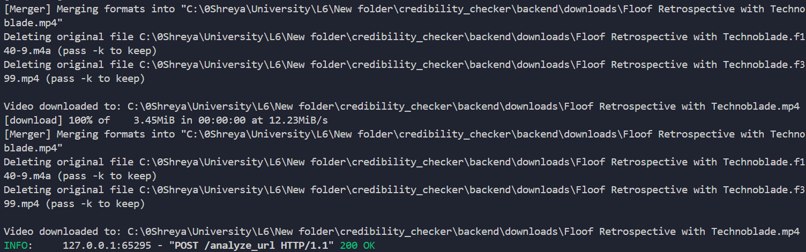

# Development Diary - 25/10/2025

## Task / Work Summary
This session focus was integrating YouTube video download and analysis features into the Deepfake Credibility Checker project.
The primary goal was to allow the Chrome Extension to send a YouTube URL to a FastAPI backend, automatically download the video, and prepare it for analysis — all without manually downloading or embedding video streams.

## Context / Problem / Challenge
- While developing the backend for the Deepfake Credibility Checker, several integration and technical issues arose:
- YouTube videos could not be processed directly via streaming URLs due to 403 Forbidden errors when using ffmpeg.
- Using yt-dlp provided links to manifests that expired quickly or required ad-handling bypasses.
- The backend also needed a clean way to save videos for later AI analysis while handling system paths and permissions consistently.
- The Chrome extension’s background.js file threw a window is not defined error when trying to fetch results and display them dynamically.
- Lastly, ffmpeg was installed on the system but not properly detected by yt-dlp.

## Approach / Method
### Problem 1 - Bypassing the YouTube Manifest Restrictions
Initially attempted to stream YouTube content directly using the manifest URLs obtained via yt-dlp.
When these failed due to expired or forbidden URLs, I decided to use yt-dlp’s local download functionality as a more reliable foundation.

### Problem 2 - Integrating yt-dlp into FastAPI
Wrote a Python function that used subprocess.run() to call yt-dlp with flags:
```python
yt-dlp -f "bestvideo[ext=mp4]+bestaudio[ext=m4a]" --merge-output-format mp4
```
This ensured that the downloaded file contained both video and audio tracks.
I added exception handling for CalledProcessError to catch failed downloads gracefully.

### Problem 3 - ffmpeg Not Detected
yt-dlp required a valid path to ffmpeg.exe.
I solved this by defining a ffmpeg_location variable and passing it into the yt-dlp command using:
```python
if ffmpeg_location:
    command.extend(["--ffmpeg-location", ffmpeg_location])
```
This ensured all video merges were successful.

### Problem 4 - Organizing Download Directory
Instead of saving files to a generic C:/Downloads, I configured the project to store videos in:
credibility_checker/downloads/
This made debugging easier and kept the project self-contained.

### Problem 5 — Chrome Extension Context Error
The window object was being referenced inside background.js, which runs in a service worker environment without DOM access.
I fixed this by removing all direct DOM access and communicating between background and result pages using chrome.tabs.sendMessage() and event listeners in results.js.

### Problem 6 — Backend Modularization
To improve maintainability, I separated the backend into two files:
- fastapi_server.py — contains all API logic and helper functions.
- main.py — runs the FastAPI server using uvicorn with reload=True.
This structure simplified future debugging and testing.

### Response / Solution
The final FastAPI backend successfully:
- Accepts a YouTube URL from the Chrome extension.
- Downloads and merges the video with audio using yt-dlp.
- Saves it in credibility_checker/downloads/.
- Returns a mock deepfake analysis result to the frontend.
The extension now opens a results.html page showing formatted analysis output dynamically.
The system is stable, modular, and ready for the next stage — integrating the actual deepfake model.

### References / Resources
yt-dlp Documentation
FastAPI Official Docs
YouTube SABR Streaming Issue Thread
FFmpeg Builds (Gyan.dev)

## Screenshots / Images
<p align="center">
  
</p>
<p align="center">
  
</p>
<p align="center">
  
</p>
<p align="center">
  
</p>

Next Steps / To-Do
- Integrate the real deepfake detection AI model into /analyze_url.
- Add asynchronous background video analysis to prevent blocking.
- Implement automatic cleanup of old downloads.
- Improve frontend UI with progress indicators.
- Package the extension for distribution testing.