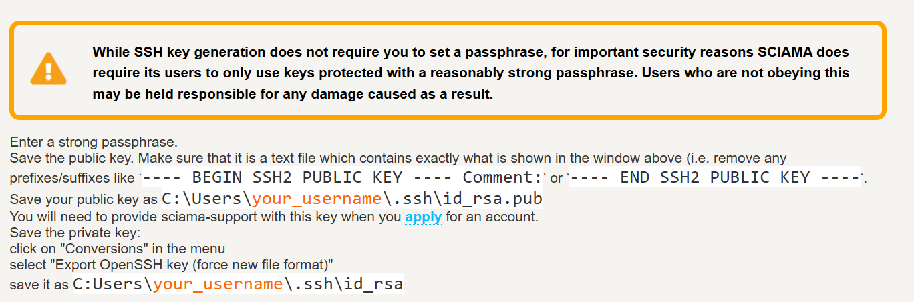

# Development Diary - 20/11/2025
## Task / Work Summary

This week, I focused on obtaining access to Sciama, the university’s high-performance supercomputer, to address the computational limitations that had been blocking my project’s progress. After recognising that my local setup and standard university hardware were insufficient for processing full-length video datasets with pretrained deepfake detection models, I began the process of applying for access to Sciama.

This task involved understanding how the supercomputer operates, what resources I would need to use, and following the official procedures to request user credentials.

## Context / Problem / Challenge

After several weeks of delay due to the unavailability of GPU resources, it became clear that my project’s next phase - running deepfake detection on full video datasets - could not be completed efficiently using standard computing equipment. The pretrained models I plan to deploy, such as XceptionNet and EfficientNet, require substantial GPU acceleration and memory capacity to process video data in real time.

My initial plan to use departmental GPU clusters was unsuccessful due to delays in their configuration, so I needed an immediate alternative that could provide equivalent or greater computational performance. This led me to Sciama, the university’s high-performance computing (HPC) system. However, gaining access to Sciama required a deeper understanding of HPC workflows and strict user onboarding procedures before credentials could be issued.

## Approach / Method

To prepare for Sciama access, I thoroughly studied the official documentation that explains its architecture, available resources, and operating procedures. This included understanding the distinction between login nodes and compute nodes, how to manage computational jobs, and the use of the SLURM job scheduler.

Before I could request an account, I was required to complete a Microsoft Form quiz assessing my understanding of Sciama’s systems and basic command-line operations. The form tested my knowledge of essential commands such as:

Creating an SSH key pair:

```ssh-keygen -t rsa -b 4096 -C "your_email@example.com"```


Number of login nodes available (answer: 2)

Command to run an interactive session on a compute node:

```sinteractive```


SLURM command to view running jobs:

```squeue```


Batch script configuration for requesting multiple nodes:

```#SBATCH --nodes=2```


Completing this documentation and quiz ensured that I understood how to operate within an HPC environment responsibly, avoiding misconfigurations or system misuse. Once I submitted the form, I officially requested access credentials to Sciama through the appropriate channels.

## Response / Solution

By completing the required documentation and knowledge verification, I successfully submitted my request for a Sciama account. I am now waiting for account credentials and confirmation from the HPC administrators.

This process provided valuable insight into the structure and management of large-scale computing systems, which will directly inform how I optimise my deepfake analysis jobs once access is granted. Although the approval stage is still pending, I now have the technical grounding necessary to use Sciama efficiently once I receive login credentials.

This marks a crucial turning point — transitioning from dependency on local or unavailable GPU resources to preparing for scalable, production-level computation using institutional infrastructure. Once access is approved, I plan to begin migrating my testing environment and model workloads to Sciama immediately.

## Screenshots / Images

<p align="center">
  
</p>
<p align="center">
  
</p>

## References / Resources

Sciama User Documentation (University of Portsmouth HPC) https://sciama.icg.port.ac.uk/windows.html

## Next Steps / To-Do
- Wait for confirmation of Sciama account setup and credentials.
- Configure SSH keys and test connection to login nodes.
- Transfer initial test scripts for deepfake model evaluation.
- Begin performance benchmarking to identify optimal compute configuration.
- Migrate full video dataset analysis workflows to Sciama once stable connection is established.